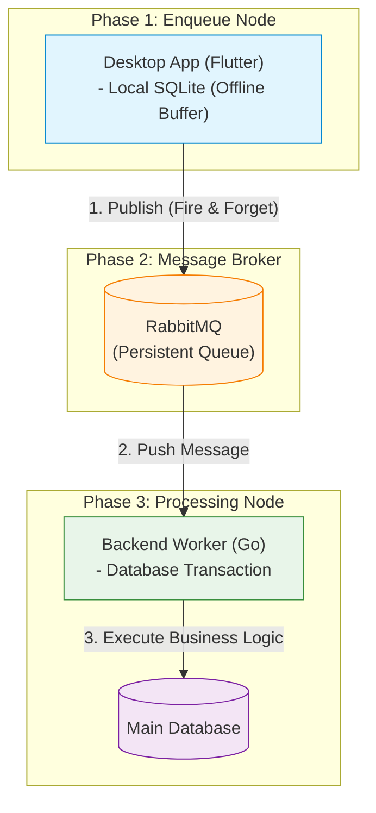
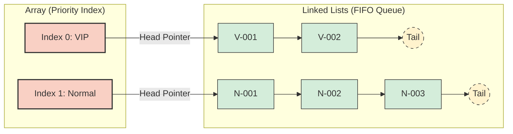
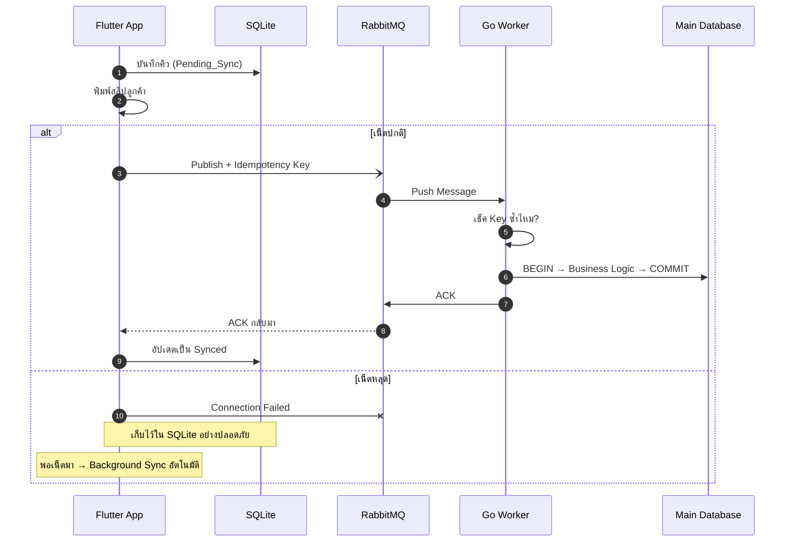

# 🎯 Queue Management System — Architecture Demo

> **"ลูกค้าจะได้กระดาษคิวเสมอ และข้อมูลคิวจะไม่มีวันสูญหาย"**

ระบบจำลอง **สถาปัตยกรรมบริหารจัดการคิว** แบบ Interactive ที่เปิดได้ทันทีในเบราว์เซอร์ — ไม่ต้องติดตั้ง ไม่ต้อง build ไม่ต้อง npm install แค่ดับเบิลคลิกไฟล์ HTML ก็เล่นได้เลย

เขียนเพื่อสาธิตแนวคิดเรื่อง **Offline-First**, **Message Broker**, **Manual ACK**, **Idempotency** และ **Fault Tolerance** ผ่าน Visual Dashboard สวยๆ ที่เห็นข้อมูลไหลจริงๆ ตั้งแต่กดคิวยันเข้า Database

<br/>

## 📸 หน้าตา Dashboard

```
┌─────────────────┬──────────────────┬─────────────────────┬──────────────┐
│  คิวในหน่วยความจำ │  แอปหน้าเคาน์เตอร์  │   RabbitMQ (Broker)  │              │
│  (Memory Queue) │ (Flutter Producer)│─────────────────────│  แผงควบคุม   │
│                 │                  │   Go Worker          │  (Control)   │
│  VIP ก่อนเสมอ    │  SQLite + Sync   │  (Consumer)         │              │
├─────────────────┼──────────────────┴─────────────────────┤              │
│  ฐานข้อมูลหลัก     │  📋 บันทึกเหตุการณ์ (Event Log)         │                 │
│  (Main DB)      │                                        │              │
└─────────────────┴────────────────────────────────────────┴──────────────┘
```

Dark theme สวย ข้อมูลไหลมี animation เห็นชัดทุก phase!

<br/>

## 🚀 เปิดใช้งาน — 3 วินาทีเท่านั้น

```bash
# macOS
open queue-system-dashboard.html

# Linux
xdg-open queue-system-dashboard.html

# Windows
start queue-system-dashboard.html

# หรือง่ายกว่านั้น... ดับเบิลคลิกไฟล์เลย!
```

> ต้องต่อเน็ต (โหลด Tailwind CDN) แค่ครั้งแรก — หลังจากนั้นทำงานได้แม้ offline

<br/>

## 💡 ระบบนี้ทำอะไรได้บ้าง?

### ✅ สาธิต Pipeline แบบ Step-by-Step

ข้อมูลคิวไหลผ่าน 6 ขั้นตอนที่เห็นได้ชัดเจน:

```
กดคิว → บันทึก SQLite → ส่ง Broker → Go Worker ประมวลผล → บันทึก DB → เสร็จ ✓
```

### ✅ ตั้ง Breakpoint หยุดดูทีละจุด

เหมือน Debugger จริงๆ เลย — ติ๊กเลือก BP1–BP6 แล้วระบบจะหยุดให้ดูทีละขั้น

### ✅ สลับ Online/Offline ได้ทันที

กดปุ่มเดียวเปลี่ยนเป็น Offline → ออกคิวได้ปกติ พิมพ์สลิปได้ → กลับ Online แล้ว Background Sync ทำงานเอง

### ✅ จำลองวิกฤต (Chaos Engineering)

- **💥 DB ล่ม** → ดู ROLLBACK + Re-queue อัตโนมัติ ไม่มีข้อมูลหาย
- **👻 คิวผี** → ดู Idempotency Key กรองข้อมูลซ้ำออกไป

<br/>

## 🏗️ สถาปัตยกรรมที่จำลอง

ระบบนี้จำลอง Production Architecture จริงๆ ไว้ในเบราว์เซอร์:



| Component ที่จำลอง      | เทคโนโลยีจริง             | สิ่งที่จำลองใน Demo                         |
| ----------------------- | ------------------------- | ------------------------------------------- |
| **Flutter Desktop App** | Flutter + Dart            | Panel "แอปหน้าเคาน์เตอร์"                   |
| **SQLite**              | SQLite Database           | Array เก็บ local queue data                 |
| **Background Isolate**  | Dart Isolate (Thread แยก) | Background Sync mechanism                   |
| **RabbitMQ**            | AMQP Message Broker       | Message queue พร้อม ACK/NACK                |
| **Go Worker**           | Go + Goroutines           | Transaction block (BEGIN → COMMIT/ROLLBACK) |
| **Main Database**       | PostgreSQL / MySQL        | Array เก็บ final queue records              |
| **Idempotency Key**     | UUID v4                   | Set เก็บ processed keys ป้องกันซ้ำ          |

<br/>

## 🧠 โครงสร้างข้อมูล — ทำไมต้อง Array of Linked Lists?

หัวใจของระบบคือ **Multi-level Priority Queue** ที่ต้องทำทั้ง Priority + FIFO + เร็ว ในโครงสร้างเดียว



**เปรียบเทียบทางเลือก:**

| โครงสร้าง                 | แยก Priority | รักษา FIFO | Enqueue  | Dequeue  | เหมาะ? |
| ------------------------- | :----------: | :--------: | :------: | :------: | :----: |
| Queue ธรรมดา              |      ❌      |     ✅     |   O(1)   |   O(1)   |   ❌   |
| Priority Queue (Heap)     |      ✅      |     ❌     | O(log n) | O(log n) |   ❌   |
| **Array of Linked Lists** |    **✅**    |   **✅**   | **O(1)** | **O(1)** | **✅** |

- **Enqueue** → ต่อท้าย (Tail) ของ Priority ที่ถูกต้อง — O(1)
- **Dequeue** → เช็ค VIP (Index 0) ก่อน ถ้าว่างค่อยไป Normal (Index 1) — O(1)

<br/>

## 🛡️ กลไกรับมือวิกฤต — ทำไมข้อมูลถึงไม่มีวันหาย?

### ฝั่ง Backend: Manual ACK + Transaction

```
Go Worker ดึงคิวจาก RabbitMQ
  └─ BEGIN Transaction
       └─ ทำ Business Logic
            ├─ สำเร็จ → COMMIT → ส่ง ACK → RabbitMQ ลบข้อความ ✅
            └─ ล้มเหลว → ROLLBACK → ไม่ส่ง ACK → RabbitMQ คืนคิว 🔄
```

### ฝั่ง Frontend: Offline-First + Background Sync

```
กดออกคิว
  └─ บันทึก SQLite ก่อนเสมอ (Pending_Sync) + พิมพ์สลิปทันที
       ├─ เน็ตปกติ → ส่ง Broker → ได้ ACK → เปลี่ยนเป็น Synced ✅
       └─ เน็ตหลุด → เก็บไว้ใน SQLite → พอเน็ตมา → Sync อัตโนมัติ 🔄
```

### ป้องกันคิวผี: Idempotency Key

ทุก Message แนบ UUID ไปด้วย → Go Worker เช็คก่อนทุกครั้ง → ถ้าเคยทำแล้ว ข้ามไปเลย = ไม่มีคิวซ้ำ



<br/>

## 🎮 วิธีเล่น — สถานการณ์แนะนำ

### 🟢 สถานการณ์ 1: ดู Pipeline ปกติ

กดเพิ่มคิว VIP หรือคิวปกติ → นั่งดูข้อมูลไหลผ่านทุก Panel จนจบ

### 🔵 สถานการณ์ 2: Debug ทีละขั้น

1. ติ๊ก Breakpoint ทุกตัว (BP1–BP6)
2. กดเพิ่มคิว → ระบบหยุดที่ BP1
3. กด **[ทีละขั้น]** เพื่อไปต่อทีละจุด → อ่าน Event Log ประกอบ

### 🟡 สถานการณ์ 3: Priority Queue

1. กดเพิ่มคิวปกติ 3 ตัวรวด (N-001, N-002, N-003)
2. กดเพิ่มคิว VIP 1 ตัว (V-001)
3. ดู V-001 แซงขึ้นไปประมวลผลก่อน!

### 🔴 สถานการณ์ 4: Offline-First

1. กดสลับเป็น **OFFLINE**
2. กดเพิ่มคิว 2–3 ตัว → สลิปพิมพ์ได้ปกติ!
3. กดสลับกลับ **ONLINE** → Background Sync ทำงานเอง

### ⚡ สถานการณ์ 5: Chaos Engineering

1. ติ๊ก **BP4** → เพิ่มคิว → กด **💥 จำลอง DB ล่ม** → ดู Recovery อัตโนมัติ
2. ติ๊ก **BP5** → เพิ่มคิว → กด **👻 จำลองคิวผี** → ดู Idempotency ทำงาน

<br/>

## 📂 โครงสร้างไฟล์

```
Queue-Management-System-Demo/
├── queue-system-dashboard.html              ← ✅ ไฟล์หลัก (ภาษาไทย)
├── queue-system-dashboard.backup.html       ← 📦 ไฟล์สำรอง (ภาษาอังกฤษ)
├── System-Architecture-Design-Document      ← 📄 เอกสารออกแบบสถาปัตยกรรม + Mermaid Diagrams
├── PROJECT-DOCUMENTATION.md                 ← 📖 เอกสารโปรเจ็กฉบับเต็ม
├── diagrams.md                              ← 📊 Diagram สำหรับ Eraser.io
└── README.md                                ← 📘 ไฟล์นี้
```

### ไฟล์ HTML — Single-File Architecture

ทุกอย่างอยู่ในไฟล์ `.html` เดียว ไม่มี dependency ไม่มี build step:

```
queue-system-dashboard.html (1,191 บรรทัด)
├── <style>   → CSS Dark Theme + Animations + Grid 4×2
├── <body>    → Header Pipeline Bar + 6 Panels + Event Console
└── <script>  → Vanilla JS (ES2017+) — State Machine + Async Pipeline
```

### เวอร์ชันไทย vs อังกฤษ

|                  | ไทย (`.html`)                   | อังกฤษ (`.backup.html`) |
| ---------------- | ------------------------------- | ----------------------- |
| **ภาษา UI**      | ไทย                             | English                 |
| **ฟอนต์**        | Noto Sans Thai + JetBrains Mono | JetBrains Mono          |
| **Pipeline Bar** | ✅ มี                           | ❌                      |
| **Logic**        | เหมือนกัน                       | เหมือนกัน               |

<br/>

## 🧰 Tech Stack

| Layer       | เทคโนโลยี                             | ทำหน้าที่อะไร                          |
| ----------- | ------------------------------------- | -------------------------------------- |
| **Layout**  | HTML5                                 | โครงสร้าง Semantic                     |
| **Styling** | CSS3 Custom Properties + Tailwind CDN | Dark theme, Grid 4x2, Animations       |
| **Logic**   | Vanilla JavaScript ES2017+            | Async State Machine, DOM API, Pipeline |
| **Font**    | Noto Sans Thai + JetBrains Mono       | อ่านง่ายทั้งไทยและ code                |

### Design Patterns ที่ใช้

| Pattern                 | อธิบายสั้นๆ                                           |
| ----------------------- | ----------------------------------------------------- |
| **Async State Machine** | Breakpoint system ด้วย Promise-based pause/resume     |
| **Global State Object** | `const S = {...}` เป็น single source of truth         |
| **Observer Pattern**    | State เปลี่ยน → render function อัปเดต UI             |
| **XSS Prevention**      | ใช้ `textContent` แทน `innerHTML` สำหรับ dynamic data |
| **Offline-First**       | บันทึก local ก่อน → Sync ทีหลัง                       |
| **Idempotency**         | UUID-based key ป้องกันการประมวลผลซ้ำ                  |
| **Chaos Engineering**   | จำลอง DB Crash + Ghost Queue เพื่อพิสูจน์ Resilience  |

<br/>

## 📚 เอกสารเพิ่มเติม

- [**System Architecture Design Document**](System-Architecture-Design-Document) — เจาะลึกโครงสร้างข้อมูล สถาปัตยกรรม และกลไกรับมือวิกฤต พร้อม Mermaid Diagrams ครบทุกส่วน
- [**Project Documentation**](PROJECT-DOCUMENTATION.md) — เอกสารฉบับเต็มอธิบายทุก Panel ทุกปุ่ม ทุก Design Pattern + คู่มือการสาธิต
- [**Eraser Diagrams**](diagrams.md) — Diagram ในฟอร์แมต Eraser.io สำหรับนำไปใช้ต่อ

<br/>

## 👨‍💻 ผู้พัฒนา

**เด็กเป็ด (Kidpech)**

---

<div align="center">

_สร้างขึ้นเพื่อสาธิตว่า "ระบบที่ดีต้องทำงานได้แม้ในสถานการณ์ที่แย่ที่สุด"_

**ไฟดับ? ข้อมูลไม่หาย | เน็ตหลุด? ลูกค้ายังได้สลิป | DB ล่ม? ระบบ Recover เอง**

</div>
