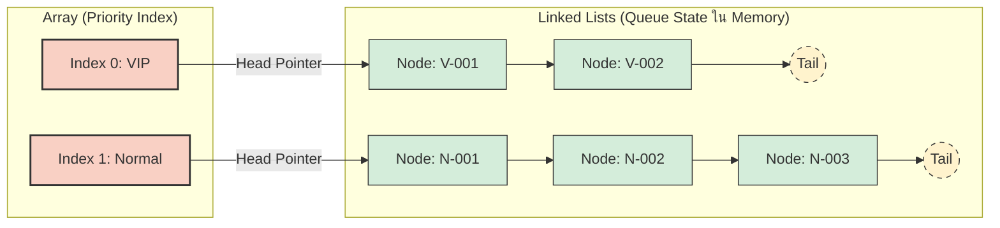
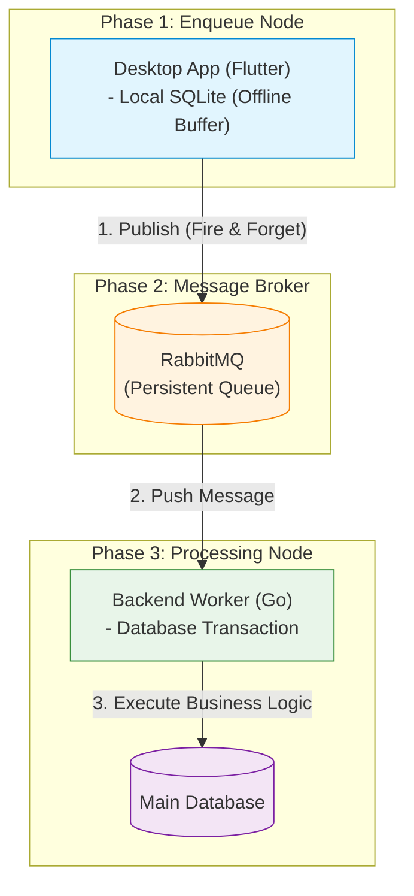
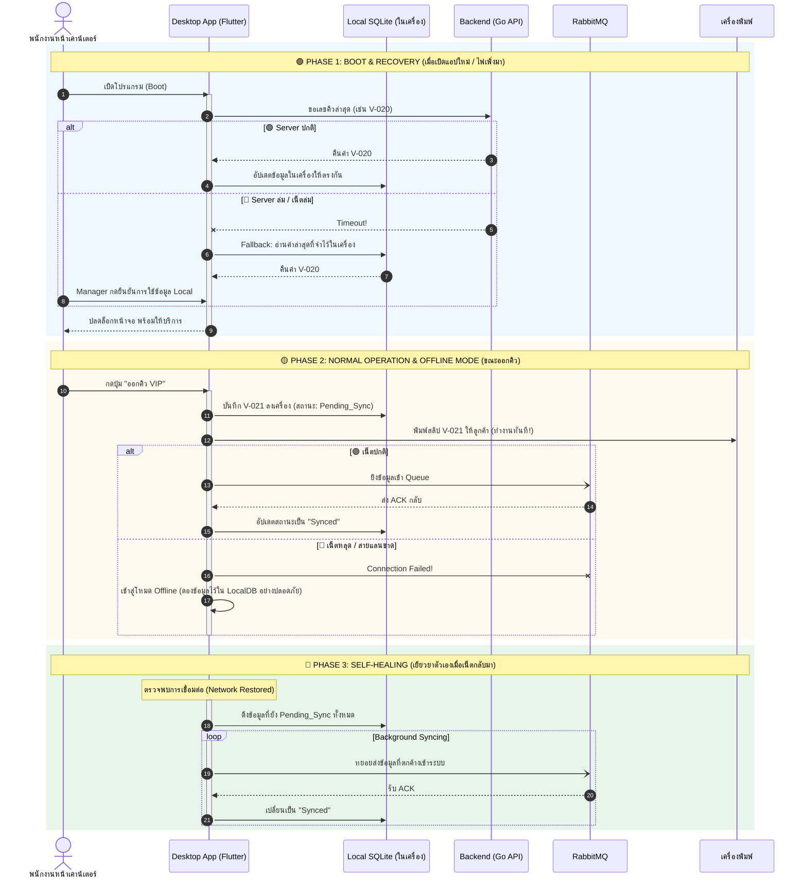
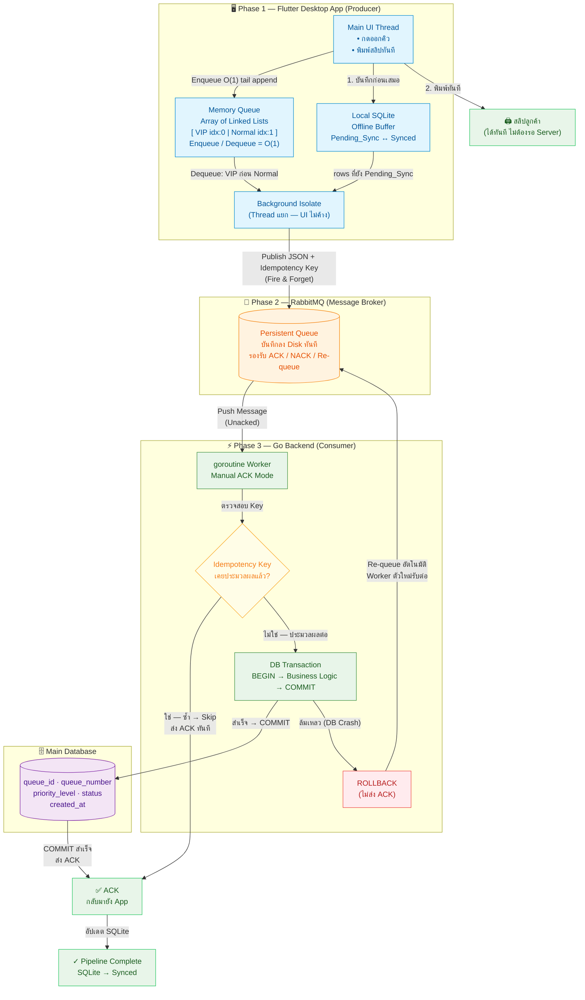

# 📊 Diagrams — เอกสารการออกแบบสถาปัตยกรรมระบบคิว

---

## 1.3 Diagram โครงสร้างข้อมูล (Data Structure)

---

## 2.2 Diagram สถาปัตยกรรมระบบภาพรวม (System Architecture Overview)

---

## 3.3 Master Diagram: วัฏจักรการรับมือวิกฤตของฝั่ง Enqueue (Crisis Management Sequence)

---

## 4. Diagram ภาพรวมระบบครบวงจร (Full System Overview)

